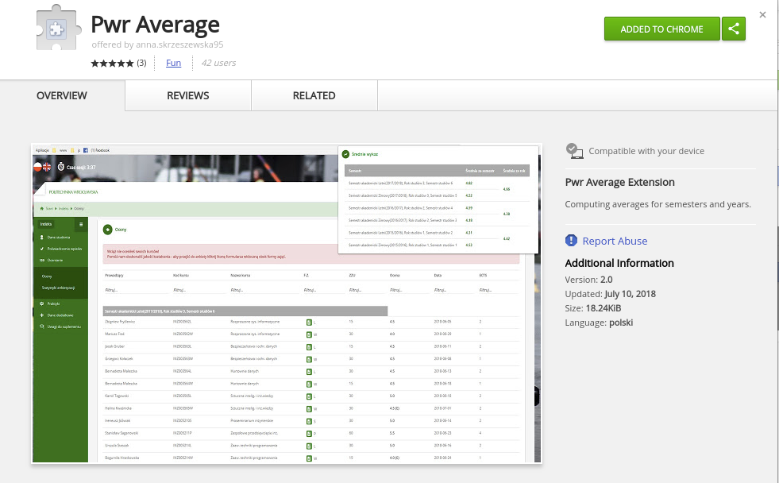
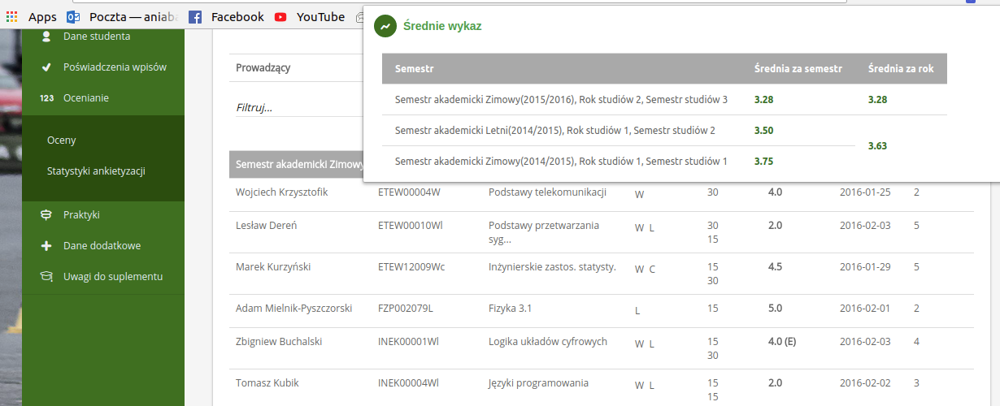

# Pwr Average Extention 
This extension was created to help university students in calculating the average they obtained in a given semester / year.  It was specially made for students of Wrocław University of Technology.

# Used Technology
Pwr Average is written in Vanilla Java Script language with usege of operations on DOM. 

# Installation and Usage
## Adding to Chrome
[Pwr Average](https://chrome.google.com/webstore/detail/pwr-average/iapakgnkbohbbochbdmjolpmpdfddmob) can be downloaded from *chrome web store*.
 

## Usage
This extention works only on for students loged in [JSOS](https://jsos.pwr.edu.pl/index.php). 
In the *Indeks* tab, select *Ocenianie* then *Oceny*.  

On the bottom of the page click *Pobierz więcej...* button to see a full list of grades for each semester. 
Then click Pwr Average icon in Chrome and enjoy! 

